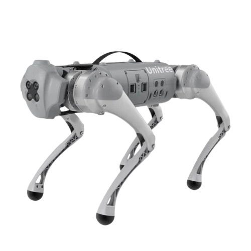
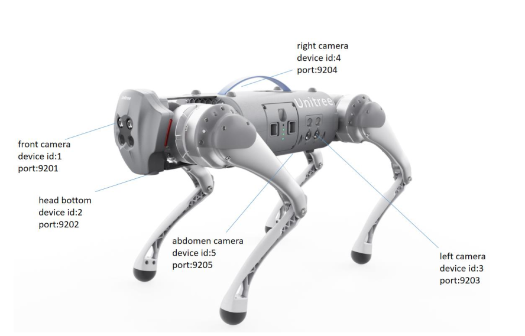
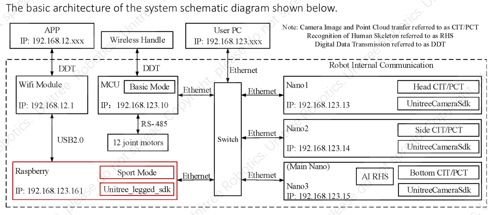

# Unitree ROS2 to Real Robot Interface 



A ROS2 interface for real-time communication with Unitree quadruped robot Go1 using the official Unitree Legged SDK. This project provides a containerized solution for robust robot control and monitoring through standard ROS2 topics and services.

## Table of Contents

- [🚀 Overview](#-overview)
- [📋 Features](#-features)
  - [Core Functionality](#core-functionality)
  - [ROS2 Topics & Services](#ros2-topics--services)
- [🏗️ Docker Architecture](#️-docker-architecture)
  - [Architecture Components](#architecture-components)
  - [Docker Build Process](#docker-build-process)
  - [Container Deployment Strategy](#container-deployment-strategy)
- [🔧 Installation & Usage](#-installation--usage)
  - [Prerequisites](#prerequisites)
  - [Quick Start](#quick-start)
  - [Instructions](#instructions)
  - [Environment Variables](#environment-variables)
  - [Cameras Configuration](#-cameras-configuration)
- [🐾​ Go1 Quick Manual](#-go1-quick-manual)
- [🔒 Safety Features](#-safety-features)
  - [Built-in Safety Mechanisms](#built-in-safety-mechanisms)
  - [Usage Example](#usage-example)
  - [Architecture Details](#architecture-details)
- [📊 Performance Considerations](#-performance-considerations)
  - [Real-time Performance](#real-time-performance)
  - [Network Optimization](#network-optimization)
- [🔍 Troubleshooting](#-troubleshooting)
  - [Common Issues](#common-issues)
- [📝 License](#-license)
- [🤝 Contributing](#-contributing)
- [📧 Contact](#-contact)

## 🚀 Overview

This interface bridges the gap between ROS2 applications and Unitree robots by:

- **Real-time UDP Communication**: Direct low-level communication with robot hardware
- **ROS2 Integration**: Standard ROS2 topics for joint states, IMU data, and remote control
- **Docker Architecture**: Multi-architecture containerized deployment (AMD64/ARM64)
- **Safety Features**: Built-in safety mechanisms and emergency stop capabilities
- **Cross-platform**: Works on both x86_64 and ARM64 architectures

## 📋 Features

### Core Functionality

- **Low-level Robot Control**: Direct motor control via UDP communication
- **High-level Robot Control**: High level control via UDP communication
- **Sensor Data Publishing**: Real-time joint states, IMU data, and wireless remote state
- **Vision perception**: High resolution stereo cameras from all sides

### ROS2 Topics & Services

For the full topic/service reference with message types, frequencies, and usage examples see [🤖 Interface Guides](#-interface-guides).

Quick overview:

| Interface | Key Topics | Key Services |
|---|---|---|
| High-level | `joint_states`, `imu`, `odom`, `cmd_vel` | `set_high_mode` |
| Low-level | `joint_states`, `imu`, `wireless_remote`, `*_foot/wrench` | `enable_low_interface`, `get_status_low_interface` |
| Face Lights | — | `set_face_color`, `set_face_animation` |

## 🏗️ Docker Architecture

The project uses a multi-architecture Docker setup optimized for both development and production environments.

### Architecture Components

```
unitree_ros2_to_real/
├── Docker/
│   ├── base.Dockerfile                # Base Dockerfile for the build
│   ├── if.Dockerfile                  # Interface Dockerfile
│   ├── if-quick.Dockerfile            # Quick building Interface Dockerfile
│   ├── cyclonedds/                    # CycloneDDS configurations for each board 
│   │   ├── cyclonedds_13.xml
│   │   ├── cyclonedds_14.xml
│   │   ├── cyclonedds_15.xml
│   │   ├── cyclonedds_generic.xml
│   │   ├── cyclonedds_local.xml
│   │   └── cyclonedds_pi.xml
│   ├── interface_entrypoint.sh        # Container entry point script
│   └── unitree_dds_env.sh             # Cyclone DDS setup for ROS2 communication
├── external_connection/               # Setup materials for the Zenoh-ROS2 DDS bridge
│   ├── setup-zenoh-bridge-ros2dds.sh
│   └── cyclonedds/
│       ├── cyclonedds_pc_eth.xml
│       ├── cyclonedds_pc_generic.xml
│       ├── cyclonedds_pc_wlan.xml
│       └── go1-setup-network.sh
├── ros2_ws/                           # ROS2 workspace
│   └── src/
│       ├── unitree_ros2_interface/    # Main interface package
│       ├── unitree_legged_msgs/       # Unitree message definitions
│       └── unitree_legged_sdk/        # Unitree SDK libraries
├── setup-ros2-image.sh                # Automated image building script
└── setup-container.sh                 # Container deployment script
```

### Docker Build Process

#### 1. **Multi-Architecture Support**

The system uses Docker buildx for multi-architecture builds:

- **Base Image**: Uses `Docker/base.Dockerfile` for common dependencies
- **Interface**: Uses `Docker/if.Dockerfile` for the main interface container
- **Interface (Quick)**: Uses `Docker/if-quick.Dockerfile` for the main interface container (quick build — consists of an update of the Docker image)

#### 2. **Base Image Strategy**

- Lightweight ROS2 Humble base image
- Ubuntu 22.04 LTS foundation
- Minimal footprint for production deployment

### Container Deployment Strategy

#### **Automated Image Building** (`setup-ros2-image.sh`)

- **Architecture Detection**: Automatically identifies host architecture
- **Platform-specific Building**: Uses `docker buildx` for cross-platform builds
- **Conditional Rebuilding**: Optimizes build time by checking existing images

#### **Container Management** (`setup-container.sh`)

- **Auto-restart Policy**: Containers automatically restart on system boot
- **Network Configuration**: Uses host networking for optimal ROS2/DDS performance
- **Resource Management**: Configures real-time priorities and memory limits
- **Device Access**: Mounts `/dev` for hardware device access
- **Actions**: install | logs | remove | update 

## 🔧 Installation & Usage

### Prerequisites

- Docker Engine with buildx support **(Required Version 6+)**
- Network access to Unitree robot (default: `192.168.123.10:8007`)

To compile the ROS2 interface on your pc make sure to have all dependencies installed:
```bash
sudo apt install \
  ros-humble-rclcpp \
  ros-humble-rclcpp-components \
  ros-humble-sensor-msgs \
  ros-humble-std-msgs \
  ros-humble-std-srvs \
  ros-humble-geometry-msgs \
  ros-humble-nav-msgs \
  ros-humble-tf2 \
  ros-humble-tf2-ros \
  ros-humble-image-transport \
  ros-humble-cv-bridge \
  ros-humble-camera-calibration-parsers \
  ros-humble-camera-info-manager \
  ros-humble-pcl-conversions \
  ros-humble-rosidl-default-generators \
  ros-humble-rmw-cyclonedds-cpp \
  python3-colcon-common-extensions
```

**Note**: ament_index_cpp and ament_cmake are part of the ros-humble-ros-base metapackage and don't need separate installation. The libs/ultraSoundSDK and libs/face_light_sdk use only precompiled .so libraries with no external apt dependencies.

### Quick Start

1. **Clone the repository**:
  ```bash
  git clone --recurse-submodules https://github.com/Tabi43/Unitree_ros2_to_real
  cd Unitree_ros2_to_real
  ```

2. **Setup the Zenoh bridge**:
  ```bash
  ./external_connection/setup-zenoh-bridge-ros2dds.sh install
  ```

3. **Eth LAN mode**:
In this case it is alrey set with the ip of the internal robot networka nd it should work.

4. **WLAN mdoe**:
You need to find out the robot ip and update the ros2_dds_robot.json5

### Instructions

For complete guides with topics, services, mode tables, and examples see [🤖 Interface Guides](#-interface-guides) below.

### Environment Variables

**Build & Container Configuration:**
- `ROS_DISTRO`: ROS2 distribution (default: `humble`)
- `IMAGE_REPO`: Docker image repository (default: `tabi43/unitree_ros2`)
- `BASE_TAG`: Base image tag (default: `base`)
- `IF_TAG`: Interface image tag (default: `if`)
- `CONTAINER_NAME`: Container name (default: `unitree_ros2_if`)
- `FORCE_BUILD`: Force local build instead of pull (default: `0`)
- `FORCE_LOCAL_BUILD`: Force local build for container (default: `1`)
- `RESTART_POLICY`: Docker restart policy (default: `unless-stopped`)
- `PRIVILEGED`: Run container in privileged mode (default: `1`)

**Feature Flags:**
- `ENABLE_CAMERA`: Enable camera functionality (default: `1`)
- `ENABLE_ULTRASOUND`: Enable ultrasound sensors (default: `0`)
- `ENABLE_FACE_LIGHTS`: Enable face lights (default: `1`)

**Camera Options:**
- `PUBLISH_RECTIFIED`: Publish rectified camera images (default: `false`)
- `PUBLISH_DEPTH`: Publish depth images (default: `false`)
- `PUBLISH_PCL`: Publish point cloud data (default: `false`)

**Network & Board Configuration:**
- `BOARD_ROLE`: Force board role detection (`head`, `body`, `main`, `pi`, or empty for auto-detection)
- `BOARD_IP`: Override board IP address (default: auto-detected)
- `ROS_LOCALHOST_ONLY`: Restrict ROS2 to localhost (default: `0`)
- `ROS_DOMAIN_ID`: ROS2 domain ID (default: `43`)
- `RMW_IMPLEMENTATION`: ROS2 middleware (default: `rmw_cyclonedds_cpp`)

**Launch File Overrides:**
- `LAUNCH_HEAD`: Head board launch file (default: `head_board.launch.py`)
- `LAUNCH_BODY`: Body board launch file (default: `body_board.launch.py`)
- `LAUNCH_MAIN`: Main board launch file (default: `main_board.launch.py`)
- `LAUNCH_PI`: Pi board launch file (default: `pi_board.launch.py`)
- `LAUNCH_INTERFACE`: Interface launch file (default: `interface.launch.py`)
- `LAUNCH_PKG`: Launch package name (default: `unitree_ros2_interface`)

#### Network Configuration

The robot communicates over a dedicated LAN. Default addresses are:

| Board | IP | Port (SDK) |
|---|---|---|
| Low-level (body) | `192.168.123.10` | `8007` |
| High-level (head) | `192.168.123.161` | `8082` |

Ensure your host machine (or the Docker container) is on the `192.168.123.x` subnet before starting the interface. For external PC access over Ethernet or WiFi, use the Zenoh-ROS2 bridge (see `external_connection/`).

### 👀 Cameras Configuration



All the cameras are available as ROS2 topics. Each camera has its own pipeline to correctly extract the raw frame and then publish it raw/rectified/compressed. There are two different approaches: the UDP bridged approach (for the front and chin cameras) and the "direct approach". They are very similar, with the only difference that for the UDP bridged approach the node that publishes the frame is receiving it from a UDP socket.

You can set your preference using the appropriate `.yaml` file, inside this [config](ros2_ws/src/unitree_ros2_interface/config) directory.

---

## 🤖 Interface Guides

### High-Level Interface

The high-level interface lets you control the robot at the behavioural level (walking, standing, damping, etc.) without managing individual motor commands. It communicates with the head board (`192.168.123.161:8082`) using the Unitree high-level UDP protocol.

#### Starting the High-Level Interface

Using the launch file directly (outside Docker):

```bash
ros2 launch unitree_ros2_interface high_level_interface.launch.py
```

Advanced options:

```bash
ros2 launch unitree_ros2_interface high_level_interface.launch.py \
  node_namespace:=unitree_go1 \
  log_level:=INFO \
  param_file_name:=high_level_interface.yaml
```

#### High-Level Topics

**Published:**

| Topic | Type | Frequency | Description |
|---|---|---|---|
| `unitree_go1/joint_states` | `sensor_msgs/JointState` | 500 Hz | 12 joint positions, velocities and efforts |
| `unitree_go1/imu` | `sensor_msgs/Imu` | 1000 Hz | IMU orientation, gyroscope and accelerometer |
| `unitree_go1/odom` | `nav_msgs/Odometry` | 100 Hz | Robot odometry (position + velocity) |
| `unitree_go1/bms_state` | `unitree_legged_msgs/BmsState` | on publish | Battery state (SOC, current, cell voltages) |
| `unitree_go1/high_interface_log` | `std_msgs/String` | on event | Interface log messages |

**Subscribed:**

| Topic | Type | Description |
|---|---|---|
| `unitree_go1/cmd_vel` | `geometry_msgs/Twist` | Velocity reference; active **only** in `VELOCITY_MODE` |
| `unitree_go1/high_cmd` | `unitree_legged_msgs/HighCmd` | Raw SDK high-level command passthrough |

> **Safety timeout**: If no `cmd_vel` is received for more than `cmd_vel_timeout` seconds (default 0.5 s), `velocity.x`, `velocity.y` and `yaw_speed` are zeroed automatically.

#### High-Level Services

| Service | Type | Description |
|---|---|---|
| `unitree_go1/set_high_mode` | `unitree_ros2_interface/srv/SetHighMode` | Set the robot operating mode |

#### Robot Modes

Modes are set by calling `set_high_mode` with the corresponding `uint8 mode` value:

| Value | Name | Description |
|---|---|---|
| `0` | `IDLE_MODE` | Robot is idle (default state after power-on) |
| `1` | `FREE_STAND_MODE` | Robot stands without position control |
| `2` | `VELOCITY_MODE` | Robot walks/moves driven by `cmd_vel` |
| `5` | `STAND_DOWN_MODE` | Robot lies down in a controlled manner |
| `6` | `STAND_UP_MODE` | Robot stands up from lying position |
| `7` | `DAMPING_MODE` | Motor damping mode — safe for manual handling |
| `8` | `RECOVERY_MODE` | Attempts to recover from an abnormal pose |
| `10` | `START` | **Macro** — transitions from `IDLE` → `STAND_UP` → `FREE_STAND` → `VELOCITY` |
| `20` | `STOP` | **Macro** — transitions from `VELOCITY` → `FREE_STAND` → `STAND_DOWN` → `IDLE` |

#### Mode Transition Rules

The interface enforces a safe transition graph — illegal transitions are rejected with a warning. Use `DAMPING` as a universal recovery point when unsure.

| From \ To | IDLE | FREE_STAND | VELOCITY | STAND_UP | STAND_DOWN | DAMPING | RECOVERY |
|---|:---:|:---:|:---:|:---:|:---:|:---:|:---:|
| **IDLE** | | | | | | ✅ | |
| **FREE_STAND** | | | ✅ | ✅ | | ✅ | |
| **VELOCITY** | | ✅ | | | | ✅ | |
| **STAND_UP** | | ✅ | | | ✅ | ✅ | |
| **STAND_DOWN** | | | | ✅ | | ✅ | |
| **DAMPING** | ✅ | ✅ | ✅ | ✅ | ✅ | ✅ | ✅ |
| **RECOVERY** | | | | | | ✅ | |

> `START` (10) and `STOP` (20) are macros that chain multiple transitions automatically — see the modes table above.

#### Example: Walk the Robot

```bash
# 1. Set robot to VELOCITY MODE using the START macro
ros2 service call /unitree_go1/set_high_mode unitree_ros2_interface/srv/SetHighMode "{mode: 10}"

# 2. Send velocity commands (linear + angular)
ros2 topic pub /unitree_go1/cmd_vel geometry_msgs/msg/Twist \
  "{linear: {x: 0.3, y: 0.0, z: 0.0}, angular: {x: 0.0, y: 0.0, z: 0.2}}"

# 3. Stop using the STOP macro
ros2 service call /unitree_go1/set_high_mode unitree_ros2_interface/srv/SetHighMode "{mode: 20}"
```

#### Example: Monitor Odometry and IMU

```bash
ros2 topic echo /unitree_go1/odom
ros2 topic echo /unitree_go1/imu
```

---

### Low-Level Interface

The low-level interface gives direct access to the 12 individual motors (joint torques, positions, velocities, and PD gains). It communicates with the body board (`192.168.123.10:8007`) using the Unitree low-level UDP protocol.

> **Warning**: Low-level commands bypass all Unitree safety logic. Incorrect gains or commands can damage the robot or cause injury. Always test in a safe environment with the robot supported off the ground first.

#### Interface States

The interface implements a state machine to ensure safe operation:

| State | Description |
|---|---|
| `DISABLED` | No commands are sent to the robot. Initial state after startup. |
| `ENABLING` | Transition — sending an initial safe command before activating. |
| `ENABLED` | Normal operation. Commands from `low_cmd` are forwarded. |
| `DISABLING` | Transition — sending safe hold commands before fully disabling. |
| `EMERGENCY_STOP` | Activated automatically on error. Sends lock commands to all joints. |

#### Starting the Low-Level Interface

```bash
ros2 launch unitree_ros2_interface low_level_interface.launch.py
```

Advanced options:

```bash
ros2 launch unitree_ros2_interface low_level_interface.launch.py \
  node_namespace:=unitree_go1 \
  log_level:=INFO \
  param_file_name:=low_level_interface.yaml
```

#### Enabling / Disabling

The low-level interface starts in `DISABLED` state. You must explicitly enable it before any motor commands are forwarded:

```bash
# Enable
ros2 service call /unitree_go1/enable_low_interface std_srvs/srv/SetBool "{data: true}"

# Disable (sends safe hold commands before stopping)
ros2 service call /unitree_go1/enable_low_interface std_srvs/srv/SetBool "{data: false}"

# Query current state
ros2 service call /unitree_go1/get_status_low_interface std_srvs/srv/Trigger
```

#### Low-Level Topics

**Published:**

| Topic | Type | Frequency | Description |
|---|---|---|---|
| `unitree_go1/joint_states` | `sensor_msgs/JointState` | 500 Hz | 12 joint positions, velocities and efforts |
| `unitree_go1/imu` | `sensor_msgs/Imu` | 1000 Hz | IMU data |
| `unitree_go1/wireless_remote` | `unitree_legged_msgs/WirelessRemote` | 100 Hz | Remote controller joystick and buttons |
| `unitree_go1/FL_foot/wrench` | `geometry_msgs/WrenchStamped` | 500 Hz | Front-left foot contact force |
| `unitree_go1/FR_foot/wrench` | `geometry_msgs/WrenchStamped` | 500 Hz | Front-right foot contact force |
| `unitree_go1/RL_foot/wrench` | `geometry_msgs/WrenchStamped` | 500 Hz | Rear-left foot contact force |
| `unitree_go1/RR_foot/wrench` | `geometry_msgs/WrenchStamped` | 500 Hz | Rear-right foot contact force |
| `unitree_go1/bms_state` | `unitree_legged_msgs/BmsState` | on publish | Battery management system state |
| `unitree_go1/low_level_interface/log` | `std_msgs/String` | on event | Interface log messages |

**Subscribed:**

| Topic | Type | Description |
|---|---|---|
| `unitree_go1/low_cmd` | `unitree_legged_msgs/LowCmd` | Per-joint motor commands (only forwarded when `ENABLED`) |

#### Low-Level Motor Command Structure

Each `LowCmd` message contains an array of **12 `MotorCmd`** entries, one per joint. Joint order:

```
Index  Joint
  0    FL_hip_joint
  1    FL_thigh_joint
  2    FL_calf_joint
  3    FR_hip_joint
  4    FR_thigh_joint
  5    FR_calf_joint
  6    RL_hip_joint
  7    RL_thigh_joint
  8    RL_calf_joint
  9    RR_hip_joint
 10    RR_thigh_joint
 11    RR_calf_joint
```

Each `MotorCmd` contains:

| Field | Type | Description |
|---|---|---|
| `mode` | `uint8` | Motor mode: `0` = rest, `1` = calibration, `2` = standard (use `2` for normal operation) |
| `q` | `float32` | Target position [rad]. Set to `PosStopF` (2.146e+9) to disable position control |
| `dq` | `float32` | Target velocity [rad/s]. Set to `VelStopF` (16000) to disable velocity control |
| `tau` | `float32` | Feed-forward torque [N·m] |
| `kp` | `float32` | Position gain (spring stiffness) |
| `kd` | `float32` | Velocity gain (damper coefficient) |

The torque applied to each joint follows: `τ = kp × (q_target − q_actual) + kd × (dq_target − dq_actual) + tau_ff`

#### Example: Hold All Joints in Place (Damping)

```bash
# A safe "soft hold" command: kp=0, kd=3, q/dq = stop values
# Build a Python helper or use ros2 topic pub with the full message
ros2 topic pub --once /unitree_go1/low_cmd unitree_legged_msgs/msg/LowCmd \
  "{motor_cmd: [
    {mode: 2, q: 2.146e9, dq: 16000.0, tau: 0.0, kp: 0.0, kd: 3.0},
    {mode: 2, q: 2.146e9, dq: 16000.0, tau: 0.0, kp: 0.0, kd: 3.0},
    {mode: 2, q: 2.146e9, dq: 16000.0, tau: 0.0, kp: 0.0, kd: 3.0},
    {mode: 2, q: 2.146e9, dq: 16000.0, tau: 0.0, kp: 0.0, kd: 3.0},
    {mode: 2, q: 2.146e9, dq: 16000.0, tau: 0.0, kp: 0.0, kd: 3.0},
    {mode: 2, q: 2.146e9, dq: 16000.0, tau: 0.0, kp: 0.0, kd: 3.0},
    {mode: 2, q: 2.146e9, dq: 16000.0, tau: 0.0, kp: 0.0, kd: 3.0},
    {mode: 2, q: 2.146e9, dq: 16000.0, tau: 0.0, kp: 0.0, kd: 3.0},
    {mode: 2, q: 2.146e9, dq: 16000.0, tau: 0.0, kp: 0.0, kd: 3.0},
    {mode: 2, q: 2.146e9, dq: 16000.0, tau: 0.0, kp: 0.0, kd: 3.0},
    {mode: 2, q: 2.146e9, dq: 16000.0, tau: 0.0, kp: 0.0, kd: 3.0},
    {mode: 2, q: 2.146e9, dq: 16000.0, tau: 0.0, kp: 0.0, kd: 3.0}
  ]}"
```

---

### Face Lights Interface

The face lights interface controls the 12 RGB LEDs on the front face of the Go1 robot. LEDs are numbered 0–5 on the left column (top to bottom) and 6–11 on the right column (top to bottom):

```
 0           6
  1   [] []   7
   2           8
    3   [] []   9
     4          10
      5         11
```

The node runs at 10 Hz and keeps track of both static colours and looping/one-shot animations.

#### Face Lights Services

##### Set a Static Colour

Service: `set_face_color` (`unitree_ros2_interface/srv/SetLedColor`)

```
Request:
  uint8 r   # Red   channel (0–255)
  uint8 g   # Green channel (0–255)
  uint8 b   # Blue  channel (0–255)
Response:
  bool res  # true = applied
```

```bash
# Set all LEDs to blue
ros2 service call /set_face_color unitree_ros2_interface/srv/SetLedColor "{r: 0, g: 0, b: 255}"

# Set all LEDs to green
ros2 service call /set_face_color unitree_ros2_interface/srv/SetLedColor "{r: 0, g: 255, b: 0}"

# Turn off all LEDs
ros2 service call /set_face_color unitree_ros2_interface/srv/SetLedColor "{r: 0, g: 0, b: 0}"
```

##### Play a Predefined Animation

Service: `set_face_animation` (`unitree_ros2_interface/srv/SetLedAnimation`)

```
Request:
  uint8 id  # Animation ID (see table below)
Response:
  bool res  # true = found and started, false = unknown ID
```

```bash
ros2 service call /set_face_animation unitree_ros2_interface/srv/SetLedAnimation "{id: 1}"
```

#### Predefined Animations

| ID | Name | Loop | Description |
|---|---|---|---|
| `1` | Blink Red | ✅ yes | All LEDs alternate between red (500 ms) and off (500 ms) |
| `2` | RGB Cycle | ✅ yes | All LEDs cycle through red → green → blue (400 ms each) |
| `3` | Flash White | ❌ no | Double white flash (200 ms on / 200 ms off) then stops |
| `4` | Sweep Blue | ✅ yes | A single blue LED sweeps around all 12 positions (100 ms per step) |
| `5` | Rainbow Sweep | ✅ yes | Rainbow gradient scrolls upward across both columns (150 ms per step) |
| `6` | Police | ✅ yes | Blue left / red right rapid alternating flashes (police-style) |

To stop any animation and turn off the LEDs:

```bash
ros2 service call /set_face_color unitree_ros2_interface/srv/SetLedColor "{r: 0, g: 0, b: 0}"
```

## 🐾​ Go1 Quick Manual

This section explains quickly how to start up the robot and how to access its internal network and connect to the boards.

### Internal Network



The internal network of the robot is administered by the Raspberry Pi board. It handles three network interfaces:
- `wlan0` The Wireless LAN used to connect the robot to the WiFi of the lab
- `wlan1` A WiFi network used to connect to the robot to control it
- `eth0` The Ethernet connection to the internal switch

By default it has been set that the wlan0 interface connects to the Rice Wifi to enable internet access to the entire internal network.

### Boards
It is possible to connect to all boards via SSH. The shared password is **123**. Yes, a very strong password.
- **Head Nano** (unitree@192.168.123.13): It is in charge of handling the 15 W speaker and the front/chin stereo camera. NoMachine is available.
- **Belly Nano** (unitree@192.168.123.14): It is in charge of the left/right stereo camera. NoMachine is not available.
- **Body Nano** (unitree@192.168.123.15): The main Nano, it is in charge of the bottom camera. NoMachine is available.
- **Raspberry** (pi@192.168.123.161): It is in charge of handling access to the network from the WiFi side and running the Sport Mode code.

## 🔒 Safety Features

### Built-in Safety Mechanisms

- **DISABLED by default**: The low-level interface starts in `DISABLED` state. Commands are not forwarded to the robot until you explicitly call `enable_low_interface`.
- **Safe-command sequence**: Before transitioning to `ENABLED`, the interface sends a safe hold command (moderate `kd`, zero `kp` and `tau`) to establish a known baseline. The same safe sequence is sent during a `DISABLE` request before the interface shuts down.
- **Emergency Stop**: A hardware watchdog monitors the robot state. If an abnormal condition is detected the interface automatically transitions to `EMERGENCY_STOP` and sends lock commands to all joints.
- **cmd_vel timeout (high-level)**: If no `cmd_vel` message is received for longer than `cmd_vel_timeout` seconds (default 0.5 s), all velocity components are zeroed to stop the robot in place.
- **Mode transition enforcement (high-level)**: The `set_high_mode` service validates every requested transition against a safe graph. Illegal transitions are rejected with a `WARN` log before any command reaches the hardware.
- **Lock-free ring buffers**: The UDP send and receive loops run in dedicated real-time threads and exchange data through lock-free double-buffered structures (`SwapBuf<T>`), preventing priority inversion and race conditions.

### Usage Example

Safe start-up and shut-down sequence for the low-level interface:

```bash
# 1. Enable the interface (sends initial safe-hold command first)
ros2 service call /unitree_go1/enable_low_interface std_srvs/srv/SetBool "{data: true}"

# 2. Verify the state is ENABLED
ros2 service call /unitree_go1/get_status_low_interface std_srvs/srv/Trigger

# 3. Send motor commands via /unitree_go1/low_cmd ...

# 4. Disable gracefully when done
ros2 service call /unitree_go1/enable_low_interface std_srvs/srv/SetBool "{data: false}"
```

### Architecture Details

#### **Thread Management**

The interface uses Unitree's LoopFunc for real-time communication:

- **UDP Send Loop**: Transmits motor commands at configurable frequency
- **UDP Receive Loop**: Receives robot state at configurable frequency
- **ROS2 Spin**: Handles ROS2 callbacks and service requests

#### **Memory Management**

- **Lock-free Communication**: Uses atomic operations for thread-safe data exchange
- **Aligned Memory**: 64-byte aligned buffers for optimal performance
- **Minimal Allocations**: Pre-allocated buffers to avoid runtime allocations

## 📊 Performance Considerations

### Real-time Performance

- **UDP Communication**: Direct UDP sockets for minimal latency
- **Thread Priorities**: Real-time thread scheduling with `CAP_SYS_NICE`
- **Memory Locking**: Prevents memory swapping with `memlock` limits
- **CPU Affinity**: Configurable CPU core binding for consistent performance

### Network Optimization

- **Host Networking**: Uses Docker host networking for optimal DDS performance
- **IPC Sharing**: Shared IPC namespace for efficient inter-process communication
- **Buffer Management**: Optimized buffer sizes for UDP communication

## 🔍 Troubleshooting

### Common Issues

#### The robot is not controllable from the remote / High Level Mode not responding

Calm down, it is not broken yet. You probably just need to restart the Sport Mode code that lets you control the robot. To restart the Sport Mode, you need to connect via SSH to the Raspberry and run the `triggerSport.sh` again.

```bash
sudo ./Unitree/autostart/triggerSport/triggerSport.sh
```

If it doesn't work, you notice that it works because the robot will stand up, restart the robot 🙂.

#### No data received from the robot

- Verify the robot is powered on and the Ethernet cable is connected.
- Confirm your host is on the `192.168.123.x` subnet: `ip addr show`.
- Ping the robot boards: `ping 192.168.123.10` (body) and `ping 192.168.123.161` (head).
- Check the CycloneDDS configuration is correct for your board role (`Docker/cyclonedds/`).

#### Interface stays in DISABLED after `enable_low_interface`

- The interface sends a safe command before enabling. If communication fails it will reject the request. Check the log topic:
  ```bash
  ros2 topic echo /unitree_go1/low_level_interface/log
  ```
- Ensure no firewall is blocking UDP traffic on port `8007`.

#### Interface enters EMERGENCY_STOP

- Check the log topic for the reason: `ros2 topic echo /unitree_go1/low_level_interface/log`
- Common cause: the robot reported an error state (motor overtemperature, abnormal joint position, etc.).
- Once the underlying cause is resolved, restart the interface node.

#### `cmd_vel` is ignored in high-level mode

- Confirm the robot is in `VELOCITY_MODE` (mode `2`). In any other mode the node discards velocity commands with a `WARN` log.
- Use the `START` macro (`mode: 10`) to transition automatically: `ros2 service call /unitree_go1/set_high_mode unitree_ros2_interface/srv/SetHighMode "{mode: 10}"`.

#### Mode transition rejected

- The high-level interface enforces a safe transition graph. Refer to the **Mode Transition Rules** table above.
- Use `DAMPING_MODE` (mode `7`) as a universal reset point — it can transition to most other modes.

#### Docker container not starting

- Check container logs: `./setup-container.sh logs`
- Verify `ENABLE_FACE_LIGHTS`, `ENABLE_CAMERA`, and other feature flags match your hardware.
- Ensure Docker Engine version ≥ 6 (required for the Unitree SDK libraries bundled in the image).

#### ROS2 topics not visible on an external PC

- Use the Zenoh-ROS2 DDS bridge (`external_connection/`) for off-robot access.
- Set `ROS_DOMAIN_ID=43` on the external PC (or match whatever value the container uses).
- For Ethernet, use `external_connection/cyclonedds/cyclonedds_pc_eth.xml`; for WiFi use `cyclonedds_pc_wlan.xml`.

#### Laserscan not pusblishing
If you want to work with the `hokuyo` laser scan see [here](https://github.com/RICE-unige/hokuyo_bringup) and the topic `unitree_go1/laser` does not publishing anything, try to restart the container to publish it.
```bash
# SSH to the main board
ssh unitree@192.168.123.15

# Script to resatrt the laser-scan container
sudo ./Unitree_ros2_to_real/setup-laser-scan-container.sh restart

# To check if it is working see the container logs
./Unitree_ros2_to_real/setup-laser-scan-container.sh logs 
```

## 📝 License

This project is licensed under the terms specified in the package.xml file.

## 🤝 Contributing

Contributions are welcome! Please ensure all changes are tested with both AMD64 and ARM64 architectures.

## 📧 Contact

Maintainer: tabi43 (marco.tabita@edu.unige.it)

---

**Note**: This interface requires physical access to a Unitree robot and proper network configuration. Always follow safety protocols when working with robotic hardware.
